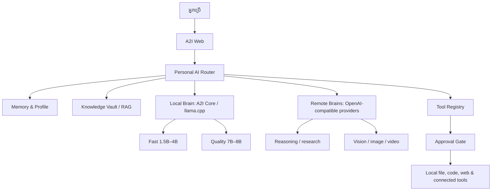

# A2I៖ ស្ថាបត្យកម្ម AI ផ្ទាល់ខ្លួន

**កំណែ:** 1.0  
**អ្នករៀបចំ:** Manus AI  
**កាលបរិច្ឆេទ:** 14 សីហា 2026

## គោលដៅ

A2I គួរត្រូវបានអភិវឌ្ឍជា **AI ផ្ទាល់ខ្លួនបែប hybrid** ដែលប្រើ local AI ជាមូលដ្ឋានដើម្បីការពារឯកជនភាព ហើយប្រើ remote AI ជាជម្រើសពេលកិច្ចការតម្រូវឱ្យមាន reasoning, context, coding ឬ multimodal ខ្លាំងជាងសមត្ថភាពកុំព្យូទ័រផ្ទាល់ខ្លួន។ វាមិនមែនគ្រាន់តែជាប្រអប់ chat ទេ ប៉ុន្តែជាប្រព័ន្ធមាន memory, knowledge, tool និង policy ច្បាស់លាស់ដែលអាចពង្រីកបានដោយមិនបំផ្លាញទិន្នន័យអ្នកប្រើ។

> **គោលការណ៍ស្នូល៖** Local-first សម្រាប់ទិន្នន័យឯកជន, best-model routing សម្រាប់គុណភាព, និង human approval មុនសកម្មភាពដែលអាចមានផលប៉ះពាល់។

## ទម្រង់កុំព្យូទ័រគោលដៅ

| ធាតុ | ការកំណត់របស់អ្នក | ន័យសម្រាប់ A2I |
|---|---:|---|
| ប្រព័ន្ធប្រតិបត្តិការ | Windows 10 Pro 64-bit | គាំទ្រ A2I Core តាម `start.bat`, PowerShell ឬ WSL2។ |
| CPU | Intel Core i5-7200U, 2 cores / 4 threads | សមស្របសម្រាប់ local inference បែប CPU តែត្រូវចាត់ចែង context និង concurrency ឱ្យតូច។ |
| RAM | 12 GB usable | 1.5B–4B Q4 ជា default; 7B/8B Q4 ជា quality mode តែមួយ session ក្នុងពេលតែមួយ។ |
| GPU | Radeon R5 M430 2 GB + Intel HD 620 | មិនគួរពឹង GPU ជា default សម្រាប់ LLM; ទុកជា optional acceleration តែប៉ុណ្ណោះ។ |
| SSD | 200 GB បន្ថែម | ល្អសម្រាប់រក្សា GGUF models, cache និង local knowledge base ប៉ុន្តែមិនជំនួស RAM/VRAM ពេល inference ទេ។ |

SSD ត្រូវប្រើសម្រាប់បង្កើត model library និង knowledge vault។ ទោះយ៉ាងណា model ត្រូវផ្ទុក context, key-value cache និងទិន្នន័យរត់ចូល memory ពេលឆ្លើយសំណួរ ដូច្នេះការទិញ SSD មិនធ្វើឱ្យ model ធំដំណើរការលឿនឡើងដោយខ្លួនឯងទេ។

## ស្ថាបត្យកម្មគោលដៅ

**A2I Web** ត្រូវនៅជាផ្ទាំងបញ្ជារបស់អ្នកប្រើ ខណៈ **Personal AI Router** ជាផ្នែកថ្មីដែលត្រូវបែងចែកកិច្ចការតាម sensitivity, complexity, modality និង model availability។ ការសន្ទនាទូទៅ និងឯកសារផ្ទាល់ខ្លួនត្រូវទៅ local brain ជាមុន។ កិច្ចការដែលត្រូវការ reasoning ខ្លាំង, context វែង, web research ឬ image/video ត្រូវស្នើសុំ ឬប្រើ remote brain តាម policy ដែលមើលឃើញដោយអ្នកប្រើ។

## Model tiers

| Tier | មុខងារសមស្រប | Model class ណែនាំ | គោលការណ៍ប្រើប្រាស់ |
|---|---|---|---|
| **Fast Local** | ជជែកប្រចាំថ្ងៃ, សង្ខេបខ្លី, command និង RAG ទំហំតូច | Qwen 1.5B–3B ឬ Gemma 2 2B ក្នុង Q4 | ជា default; ឆ្លើយតបលឿន និងការពារឯកជនភាព។ |
| **Balanced Local** | ខ្មែរ/អង់គ្លេស, ឯកសារវែងមធ្យម, កូដស្រាល | Qwen 3B–4B Q4; SEA-LION 4B vision នៅពេល hardware អនុញ្ញាត | ត្រូវមាន model profile និង memory/context limit ច្បាស់លាស់។ |
| **Quality Local** | ការសរសេរល្អ, reasoning ល្អជាង និង coding | Qwen 7B, Qwen Coder 7B ឬ Llama 8B ក្នុង Q4 | រត់លើ CPU និង RAM 12 GB; បើកតែមួយ session ហើយបង្ហាញសញ្ញាថាអាចយឺត។ |
| **Remote Specialist** | reasoning ជ្រៅ, context ធំ, research, image/video និង model លើស 8B | OpenAI-compatible provider ដែលអ្នកកំណត់ | ផ្ញើតែ context ចាំបាច់; បង្ហាញ provider និងសុំអនុម័តសម្រាប់ទិន្នន័យ sensitive។ |

SEA-LION គឺជាគ្រួសារ model open-source, multilingual និង multimodal ដែលផ្តោតលើភាសា និងបរិបទអាស៊ីអាគ្នេយ៍។ ទំព័រ model ផ្លូវការរបស់គេបង្ហាញជម្រើស Qwen 4B vision, Qwen 8B instruct និង Gemma E2B/27B ដែលអាចប្រើជា baseline ក្នុងការធ្វើតេស្តភាសាខ្មែរ និង multimodal របស់ A2I។ [1] [2]

## សមត្ថភាពផលិតផលដែលត្រូវសម្រេច

| ដែនសមត្ថភាព | កម្រិតទី 1: ត្រូវមាន | កម្រិតទី 2: ពង្រីក | គោលការណ៍សុវត្ថិភាព |
|---|---|---|---|
| Chat និង Khmer UX | Chat ខ្មែរ/អង់គ្លេស, model picker, streaming, export | Persona, spoken Khmer, tone preferences | មិនរក្សាទុក secret ក្នុង transcript។ |
| Memory | Profile, preference និង summary memory ក្នុង local storage/database | Semantic long-term memory និង memory review UI | អ្នកប្រើអាចមើល កែ លុប និងបិទ memory បាន។ |
| Knowledge | Local folders, PDF/DOCX/XLSX ingestion, citation និង source preview | Hybrid retrieval, reranking, incremental indexing | ឯកសារផ្ទាល់ខ្លួននៅក្នុង local vault ជា default។ |
| Research | Search/read/summarize ជាមួយ source citations | Multi-source research plan និង comparison report | Provider/tool ត្រូវមាន provenance និង URL validation។ |
| Coding | Repo map, code Q&A, safe edit preview និង test feedback | Worktree sandbox, PR generation និង regression tests | មិន write/commit/push ដោយគ្មាន explicit approval។ |
| Media | Voice input/output និង image attachment | Image/video/audio generation តាម remote specialist | បង្ហាញ provider និងតម្លៃ/limit មុន generate។ |
| Automations | Manual tool invocation និង approval cards | Calendar/email/files workflows និង schedules | គ្មាន send, delete, publish ឬ payment ដោយគ្មាន approval។ |

## ស្ថានភាព repository និងហានិភ័យដែលត្រូវដោះស្រាយ

ការពិនិត្យ source បង្ហាញថា A2I មាន FastAPI core, local BM25 knowledge, OpenAI-compatible API, coding-agent endpoints និង Next.js web UI រួចហើយ។ ទោះជាយ៉ាងណា មុខងារទាំងនេះត្រូវបានប្រមូលផ្តុំខ្លាំងនៅក្នុង `a2i-web/app/chat/chat-core.ts` និងពឹងលើ browser `localStorage` សម្រាប់ chats និង provider credentials។ `next.config.ts` ក៏បិទ type checking និង linting នៅពេល build ដែលបន្ថយសមត្ថភាពរក bug មុន deploy។

| អាទិភាព | បញ្ហា | ផលប៉ះពាល់ | ការកែលម្អដែលបានណែនាំ |
|---|---|---|---|
| P0 | Type/lint validation ត្រូវបានបិទ និង test/CI សម្រាប់ A2I-owned code មិនទាន់មាន | Bug អាចឡើង production ដោយមិនត្រូវបានចាប់ | បើក strict checks, បន្ថែម unit/integration tests និង GitHub Actions។ |
| P0 | Provider keys និង server-brain settings រក្សាទុកក្នុង `localStorage` | XSS ឬ shared browser អាចបង្ហាញ secret | Default ទៅ session-only; ត្រូវ encrypt/store server-side សម្រាប់ account mode; បង្ហាញ clear-data control។ |
| P1 | `chat-core.ts` ជា module ធំ | ពិបាក test, audit និងបន្ថែម feature | បែងចែកជា router, provider clients, memory, retrieval, tool registry និង UI controllers។ |
| P1 | A2I Core CORS អនុញ្ញាត origin/method/header ទាំងអស់ | ពេល bind ទៅ LAN អាចបង្កើន attack surface | Localhost-only ជា default, token authentication និង explicit trusted origins សម្រាប់ LAN mode។ |
| P1 | Repo មាន vendor/fork ធំជាច្រើន | Update, licensing និង security patch ពិបាកគ្រប់គ្រង | កំណត់ ownership manifest, version pins និង dependency update policy។ |

## Roadmap អនុវត្ត

### Release 1 — Personal AI Foundation

ការចេញកំណែដំបូងត្រូវធ្វើឱ្យ A2I មានគុណភាព production baseline មុនបន្ថែម feature ធ្ងន់។ ការងាររួមមាន GitHub Actions សម្រាប់ type check, lint និង test; បើក build validation; បង្កើត model profiles សម្រាប់ Fast, Balanced និង Quality; បង្ហាញ RAM guidance; និងបង្កើត documentation សម្រាប់ Windows local setup។ ផ្នែក security ត្រូវធ្វើ session-only API key ជា default, clear-data button និង harden Core's network mode។

### Release 2 — Memory និង Knowledge Vault

កំណែទីពីរត្រូវបង្កើត local encrypted vault ដែលបំបែក chats, profile, memories និង documents។ ការស្វែងរកត្រូវប្រើ BM25 ដែលមានរួចជាមួយ source citations និង document-management UI។ PDF និង spreadsheet ingestion គួរតែដំណើរការក្នុង local process ដោយមាន index queue និង progress report។

### Release 3 — Tool-enabled Personal Agent

កំណែទីបីត្រូវបន្ថែម tool registry មួយដែលមាន capability declaration, permission scope, audit log និង approval gate។ វាអាចចាប់ផ្តើមពី read-only file/document/repository/search tools មុនពង្រីកទៅ email, calendar និង automation។ គ្រប់ tool ដែលមាន side effect ត្រូវបង្ហាញ preview និងទាមទារ explicit confirmation។

### Release 4 — Specialist Brains និង Multimodal

កំណែទីបួនត្រូវដាក់ router ដែលប្ដូរទៅ model តាម task។ Local model ជា default ហើយ cloud/remote model គ្រាន់តែជាជម្រើសសម្រាប់ reasoning, research, vision, image, audio និង video។ Multimodal models និង SEA-LION គួរត្រូវបាន benchmark លើសំណួរខ្មែរ និងឯកសារពិតរបស់អ្នក មុនកំណត់ជាផ្លូវការ។

## លក្ខខណ្ឌទទួលយក

A2I ត្រូវចាត់ទុកថាពេញលេញសម្រាប់ release បឋមនៅពេលវាអាចចាប់ផ្តើមលើ Windows ដោយមិនទាមទារ cloud; ជ្រើស Fast/Quality/Remote model mode បាន; បង្ហាញលក្ខខណ្ឌ hardware និង model state; answer ដោយយោងឯកសារផ្ទាល់ខ្លួន; ប្រើ tool ដែលមាន approval; clear memory/keys បាន; និង CI ពិនិត្យ code quality មុន merge។

## References

[1] [SEA-LION: Empowering Open Multilingual AI for Southeast Asia](https://sea-lion.ai/)

[2] [SEA-LION Model Family](https://sea-lion.ai/models/)

